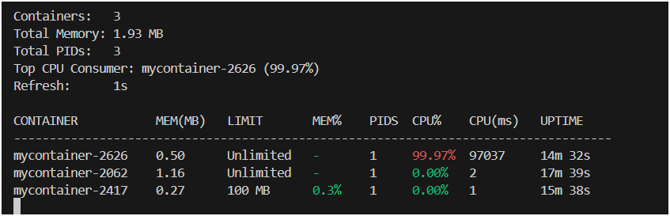

# Container Observability Platform

A lightweight observability platform built in C++ for monitoring Linux containers through direct interaction with Cgroups v2.

This project was developed as a companion system to my custom container runtime, where containers are created using Linux namespaces, chroot, and Cgroups. The platform automatically discovers running containers, collects resource metrics directly from kernel control files, and presents them through a live terminal dashboard.

## Motivation

After building a container runtime from scratch, I wanted visibility into how containers consumed system resources at runtime.

Rather than relying on external monitoring tools, I built a dedicated observability layer that directly reads Linux Cgroups v2 metrics and provides real-time insights into container resource utilization.

This mirrors the architecture used by modern observability systems, where lightweight agents collect kernel-level metrics and expose them to monitoring dashboards.

## Dashboard



## Features

* **Automatic container discovery** through Cgroups v2 scanning
* **Real-time memory monitoring** and active sorting (descending by memory consumption)
* **Memory utilization % calculation** with dynamic ANSI colors (Green <= 50%, Yellow > 50%, Red > 80%)
* **CPU utilization % monitoring** using stateful delta calculations
* **Process uptime tracking** calculated directly from `/proc/<pid>/stat` (relative to system uptime)
* **Process count monitoring** (`pids.current`)
* **Cumulative CPU usage (ms)** displayed in a separate stats column
* **Host Summary dashboard** (Total containers, memory, active PIDs) with a live 1s refresh
* **Modular architecture** separating discovery, metrics collection, and presentation layers

## System Architecture

```text
Custom Container Runtime
           │
           ▼
   Linux Cgroups v2
           │
           ▼
Container Discovery Layer (container.cpp)
           │
           ▼
 Metrics Collection Layer (metrics.cpp) — Stateful CPU delta & Uptime tracking
           │
           ▼
 Terminal Dashboard (display.cpp) — Real-time memory sorting & ANSI colors
```

## Project Structure

```text
collector/
├── main.cpp
├── container.cpp
├── container.h
├── metrics.cpp
├── metrics.h
├── display.cpp
└── display.h
```

### Discovery Layer

Responsible for identifying active containers by scanning Cgroup directories.

### Metrics Layer

Collects runtime statistics directly from Linux kernel control files, calculating CPU, uptime, and memory metrics:

* memory.current
* memory.max (Memory % limit calculations)
* pids.current
* cpu.stat (Stateful CPU % delta calculations)
* cgroup.procs & /proc/<pid>/stat (Uptime calculations)

### Presentation Layer

Formats and displays collected metrics in a continuously refreshing terminal dashboard with custom ANSI threshold coloring.

## Technologies

* C++
* Linux
* Cgroups v2
* Filesystem API (C++17)
* Systems Programming

## Example Output

```text
COP Monitor

Containers:   3
Total Memory: 1.93 MB
Total PIDs:   3
Top CPU Consumer: mycontainer-2626 (99.97%)
Refresh:      1s

CONTAINER           MEM(MB)   LIMIT       MEM%    PIDS  CPU%    CPU(ms)   UPTIME    
------------------------------------------------------------------------------------
mycontainer-2626    0.50      Unlimited   -       1     99.97%  97037     14m 32s   
mycontainer-2062    1.16      Unlimited   -       1     0.00%   2         17m 39s   
mycontainer-2417    0.27      100 MB      0.3%    1     0.00%   1         15m 38s   
```

## Future Improvements

* Historical metric storage and logging
* REST API layer for metrics exporting
* Interactive curses/ncurses dashboard
* Alerting and threshold-based monitoring

## Key Learning Outcomes

* Linux container internals
* Cgroups v2 resource management
* Systems programming in C++ (CPU & Memory delta tracking)
* Observability architecture
* Runtime metric collection
* Modular software design
